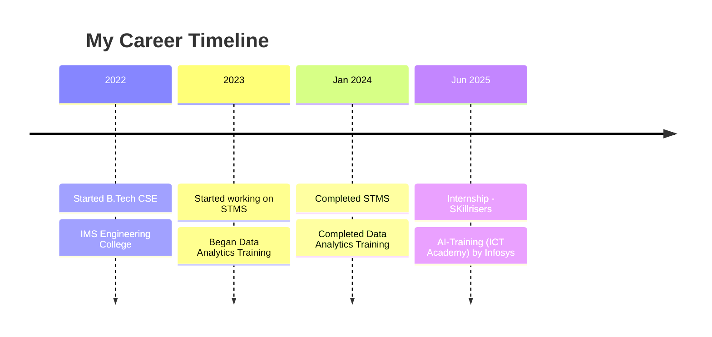

# 🚀 Hey there, I'm Ojas Gupta! 

<div align="center">
  
<div align="center">
 
<p align="center">
  <a href="http://www.linkedin.com/in/ojas-gupta-883804278/">
    
  </a>
  <a href="mailto:ojasgupta2003@gmail.com">
    
  </a>
</p>


---

## 🧑‍💻 About Me

```python
class AboutMe:
    def __init__(self):
        self.name = "Ojas Gupta"
        self.role = "B.Tech Computer Science Student"
        self.college = "IMS Engineering College, Ghaziabad"
        self.interests = ["Machine Learning", "Full Stack Development", "Problem Solving"]
        self.learning = ["Full Stack Development", "Artificial Intelligence"]
    
    def say_hi(self):
        print("Thanks for visiting my GitHub profile! Let's build something awesome together 🚀")

me = AboutMe()
me.say_hi()
```

## ⚙️ Tech Stack
<div align="center">

  ### **Languages**
  [](https://www.python.org/)
  

  ### 📊 Data & Analytics
  [](https://pandas.pydata.org/)
  [](https://numpy.org/)
  [](https://matplotlib.org/)
  [](https://www.tableau.com/)

  ### **Frameworks / Tools**
  
  
  
  ### **Databases**
  
  
  
  ### **Cloud Platforms**
  [](https://aws.amazon.com/)
  [](https://azure.microsoft.com/)

</div>

## 📂 Featured Projects

<div align="center">

### 🚦 Smart Traffic Management System
<p align="center">
  <a href="https://github.com/ojas-03/STMS">
    
  </a>
</p>

*AI-driven traffic control system that optimizes signal timings dynamically*

**Tech Stack:** 
 
 


---

### 🎮 Space Invaders Game
<p align="center">
  <a href="https://github.com/ojas-03/Space-Invaders-Pygame-">
    
  </a>
</p>

*A modern version of the classic arcade game built using Python Pygame*

**Tech Stack:** 
 


</div>

## 📊 GitHub Stats

<div align="center">
  <a href="https://github.com/anuraghazra/github-readme-stats">
    
  </a>
  <a href="https://github.com/anuraghazra/github-readme-stats">
    
  </a>
</div>

<div align="center">
  
</div>

<div align="center">
  
</div>

## 💼 Professional Journey



## 📊 Development Breakdown

```text
**Data Structures and Algorithms** - █████████████████░░░ 85%                                                                          
**Machine Learning**               - ███████░░░░░░░░░░░░░ 35%
**Frontend Development**           - ██████████████░░░░░░ 70%
**Backend Development**            - █████████░░░░░░░░░░░ 45%
**Cloud Technologies**             - ███░░░░░░░░░░░░░░░░░ 15%
```


### 🎯 Current Focus Areas
- 📊 **Data Structures and Algorithms** - Enhancing my problem-solving skills & optimizing code efficiency
- 🤖 **Machine Learning** - Data-driven decision making  
- ☁️ **Cloud Technologies** - AWS deployment and scaling
- 🚀 **Full-Stack Development** - End-to-end application development


## 🚀 Contribution Graph
<div align="center">  </div>

## 🤝 Let's Connect & Collaborate!

<div align="center">

### 💡 Open to opportunities in:

🤖 **Full Stack Development**  
📊 **Software Development Engineer - I**  
🔬 **AI Research & Development**  
🚀 **Startup collaborations**

### Let's build something amazing together! 🚀

[](http://www.linkedin.com/in/ojas-gupta-883804278/)
[](mailto:ojasgupta2003@gmail.com)


</div>
